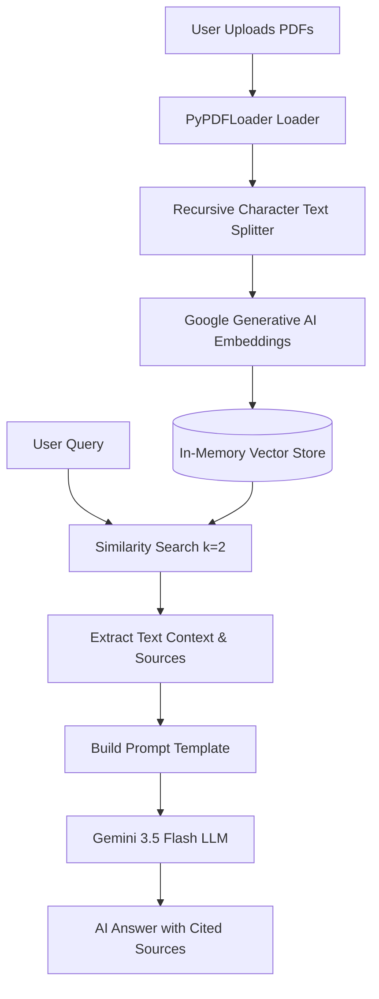

# Enterprise Document Intelligence: Multi-PDF RAG Chatbot

An elegant, production-ready Retrieval-Augmented Generation (RAG) chatbot designed to ingest, process, and query multiple PDF documents simultaneously. This application is powered by Google Gemini API and LangChain, featuring a highly-polished custom dark-mode interface built with Streamlit.

---

## 🚀 Key Features

* **Multi-PDF Document Processing**: Ingest and partition multiple PDFs at once.
* **Intelligent Document Partitioning**: Text is split into semantically rich chunks using LangChain's `RecursiveCharacterTextSplitter`.
* **Zero-Cloud-Footprint Vector Indexing**: Chunks are embedded using `GoogleGenerativeAIEmbeddings` and indexed locally in an in-memory vector space (`InMemoryVectorStore`).
* **Source & Page Citation Cards**: Every AI response lists the exact source PDF document name and page number references, preventing hallucinations and ensuring auditable facts.
* **Grouped & Deduplicated References**: Citations from the same PDF are grouped into a single card (e.g. `Pages 3, 5`) to keep the chat interface clean and distraction-free.
* **Responsive Custom UI**: Implements a custom Google-font-driven dark theme with glassmorphic cards, custom avatar icons, and a control sidebar.
* **State Management**: Includes session clearing and a one-click **Reset Engine** mechanism to easily switch documents.

---

## 🛠️ Tech Stack & Libraries

* **Core**: Python 3.11+
* **Frontend UI**: Streamlit
* **Orchestration**: LangChain & LangChain Community
* **LLM & Embeddings**: ChatGoogleGenerativeAI (`gemini-3.5-flash`) & GoogleGenerativeAIEmbeddings (`models/gemini-embedding-001`)
* **Document Loading**: PyPDF

---

## 📐 System Architecture

Below is the workflow showing how uploaded documents are processed and queried in real-time:



---

## 📂 Project Structure

```text
├── .streamlit/
│   └── config.toml          # Default Streamlit production server settings
├── utils/
│   └── logger.py            # Logging utility configurations
├── app.py                   # Self-contained Streamlit UI & RAG logic
├── requirements.txt         # Optimized project dependencies for cloud hosting
├── .env.example             # Example template for setting up environment keys
├── .gitignore               # Config to prevent uploading secrets (.env) to GitHub
└── README.md                # Project documentation
```

---

## ⚙️ How to Deploy & Run

### Method 1: Streamlit Community Cloud (Free Hosting - Recommended for Portfolios)

Streamlit Community Cloud is the best way to showcase this chatbot to recruiters.

1. **Push the repository to GitHub** (Make sure `.env` is omitted; our `.gitignore` handles this automatically).
2. Go to [share.streamlit.io](https://share.streamlit.io/) and log in with GitHub.
3. Click **Create app** and select your repository, branch, and main file path (`app.py`).
4. Click **Advanced settings...** -> **Secrets** and paste your API key:
   ```toml
   GEMINI_API_KEY = "your-actual-api-key-here"
   ```
5. Click **Deploy**. Your app will be live on a custom sub-domain in less than a minute!

---

### Method 2: Local Development Setup

If you want to run this application on your local machine, follow these steps:

#### 1. Clone the repository and navigate to it:
```bash
git clone https://github.com/YOUR_USERNAME/enterprise-rag-chatbot.git
cd enterprise-rag-chatbot
```

#### 2. Create and activate a Python virtual environment:
```bash
# Windows
python -m venv venv
venv\Scripts\activate

# macOS / Linux
python3 -m venv venv
source venv/bin/activate
```

#### 3. Install the optimized requirements list:
```bash
pip install -r requirements.txt
```

#### 4. Configure your environment variables:
Create a `.env` file in the root directory:
```bash
GEMINI_API_KEY=your_gemini_api_key_here
```

#### 5. Run the application:
```bash
streamlit run app.py
```
Open your browser at `http://localhost:8501` to start chatting with your documents.

---

## 📄 License
This project is open-source and available under the [MIT License](LICENSE). Feel free to use and adapt it for your own portfolio!
